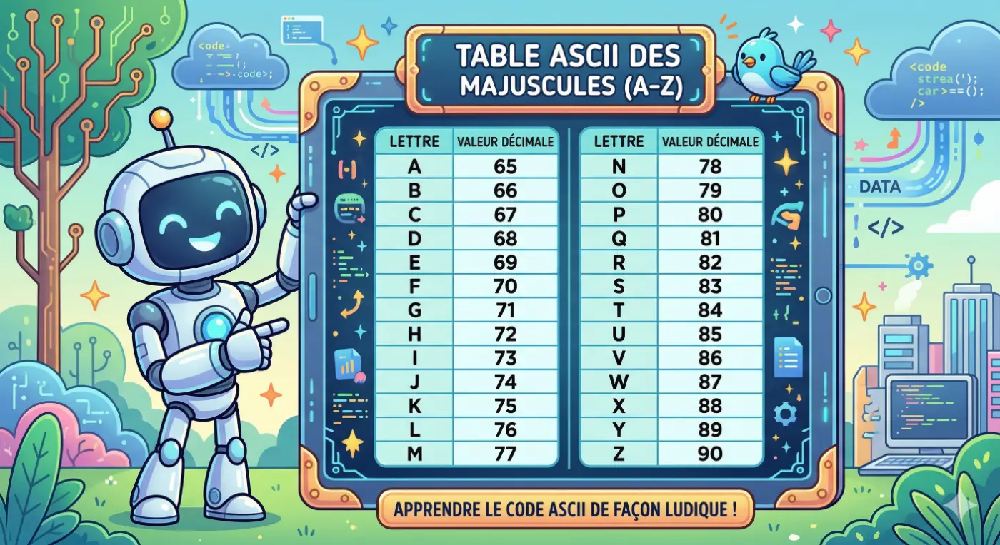
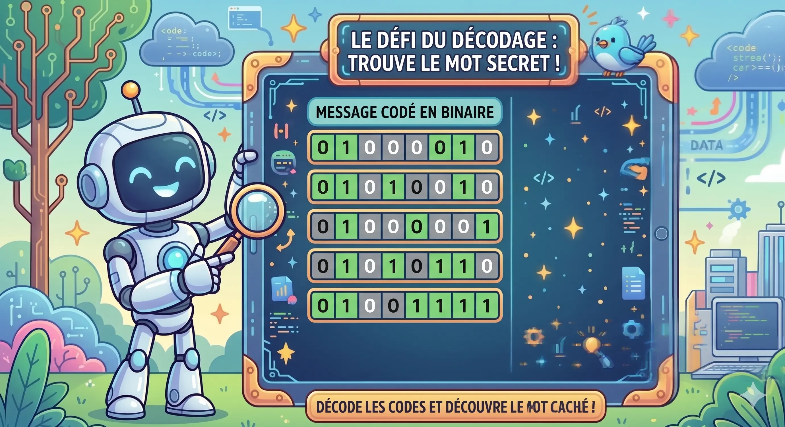

<!-- _class: lead center -->
<!-- _paginate: skip -->
<!-- _footer: "" -->

# Le codage de l'information

## Introduction au système binaire

### 3TT informatique

---

# Plan de la leçon

1. Mise en situation
2. L'unité de base : Bit et Octet
3. Acquisition de la théorie
4. Défi pratique : Le décodage
5. Synthèse

---

# Le langage de l'ordinateur

### Comment un ordinateur, composé uniquement de fils et de puces, comprend-il un texte ou une image ?

---

## Grâce au courant électrique !
  - Le courant passe = **1**
  - Le courant ne passe pas = **0**

> Un composant informatique n'a que deux états fondamentaux. C'est la base du système binaire.

---

# Le vocabulaire indispensable

- **Le Bit** (*Binary Digit*) : L'unité d'information la plus petite. Il ne peut valoir que 0 ou 1.
- **L'Octet** (*Byte*) : Un regroupement de **8 bits**.

> Avec un octet, l'ordinateur peut combiner des 0 et des 1 pour représenter des nombres, et par extension, des lettres !

---

# Convertir le binaire en décimal

- Dans notre système habituel (base 10), on utilise les unités, dizaines, centaines, etc.
- Dans le système de l'ordinateur (base 2), **chaque position a un poids**.
- De droite à gauche, pour un octet, les poids sont : 
  **1, 2, 4, 8, 16, 32, 64, 128**

> $Valeur = b_7 \cdot 2^7 + b_6 \cdot 2^6 + ... + b_0 \cdot 2^0$

---

# Exemple de conversion

Prenons l'octet binaire suivant : **`01000001`**

| Poids | 128 | 64 | 32 | 16 | 8 | 4 | 2 | 1 |
|:---:|:---:|:---:|:---:|:---:|:---:|:---:|:---:|:---:|
| **Bit** | 0 | **1** | 0 | 0 | 0 | 0 | 0 | **1** |

- Additionnons les poids où se trouve un "1" : **64 + 1 = 65**
- Que faire de ce nombre ? L'ordinateur utilise la **table ASCII** pour traduire les nombres en texte.
- Dans cette table, le nombre 65 correspond à la lettre majuscule **'A'**.

---
# La table ASCII ?!

---

---

# À vous de jouer !

- **Votre mission :** Transcoder un message binaire secret.
- **Outils à disposition :**
  - La méthode de calcul des poids.
  - Une table ASCII simplifiée (Les lettres de 65 à 90).
- Le message contient 5 lettres... saurez-vous le déchiffrer ?

---

---

# Solution

---
<!--  _footer: "" -->
<!-- _class: "split" -->
# 01000010

> | Poids | Bit | Calcul | Résultat |
> | :---: | :---: | :--- | :---: |
> | 128 | 0 |  |  |
> | **64** | **1** |  |  |
> | 32 | 0 |  |  |
> | 16 | 0 |  |  |
> | 8 | 0 |  | |
> | 4 | 0 |  |  |
> | **2** | **1** |  |  |
> | 1 | 0 |  |  |
> | | | **TOTAL** |  |

> ### Dans la table ASCII
> ### ?? correspond à la lettre *?*
---
<!--  _footer: "" -->
<!-- _class: "split" -->
# 01000010

> | Poids | Bit | Calcul | Résultat |
> | :---: | :---: | :--- | :---: |
> | 128 | 0 | 128 x 0 | 0 |
> | **64** | **1** | **64 x 1** | **64** |
> | 32 | 0 | 32 x 0 | 0 |
> | 16 | 0 | 16 x 0 | 0 |
> | 8 | 0 | 8 x 0 | 0 |
> | 4 | 0 | 4 x 0 | 0 |
> | **2** | **1** | **2 x 1** | **2** |
> | 1 | 0 | 1 x 0 | 0 |
> | | | **TOTAL** | **66** |

> ### Dans la table ASCII
> ### 66 correspond à la lettre *B*
---
<!--  _footer: "" -->
<!-- _class: "split" -->
# 01010010

> | Poids | Bit | Calcul | Résultat |
> | :---: | :---: | :--- | :---: |
> | 128 | 0 |  |  |
> | **64** | **1** |  |  |
> | 32 | 0 |  |  |
> | **16** | **1** |  |  |
> | 8 | 0 |  |  |
> | 4 | 0 |  |  |
> | **2** | **1** |  |  |
> | 1 | 0 |  |  |
> | | | **TOTAL** |  |

> ### Dans la table ASCII
> ### ?? correspond à la lettre *?*
---
<!--  _footer: "" -->
<!-- _class: "split" -->
# 01010010

> | Poids | Bit | Calcul | Résultat |
> | :---: | :---: | :--- | :---: |
> | 128 | 0 | 128 x 0 | 0 |
> | **64** | **1** | **64 x 1** | **64** |
> | 32 | 0 | 32 x 0 | 0 |
> | **16** | **1** | **16 x 1** | **16** |
> | 8 | 0 | 8 x 0 | 0 |
> | 4 | 0 | 4 x 0 | 0 |
> | **2** | **1** | **2 x 1** | **2** |
> | 1 | 0 | 1 x 0 | 0 |
> | | | **TOTAL** | **82** |

> ### Dans la table ASCII
> ### 82 correspond à la lettre *R*
---
<!--  _footer: "" -->
<!-- _class: "split" -->
# 01000001

> | Poids | Bit | Calcul | Résultat |
> | :---: | :---: | :--- | :---: |
> | 128 | 0 |  |  |
> | **64** | **1** |  |  |
> | 32 | 0 |  |  |
> | 16 | 0 |  |  |
> | 8 | 0 |  |  |
> | 4 | 0 |  |  |
> | 2 | 0 |  |  |
> | **1** | **1** |  |  |
> | | | **TOTAL** |  |

> ### Dans la table ASCII
> ### ?? correspond à la lettre *?*
---
<!--  _footer: "" -->
<!-- _class: "split" -->
# 01000001

> | Poids | Bit | Calcul | Résultat |
> | :---: | :---: | :--- | :---: |
> | 128 | 0 | 128 x 0 | 0 |
> | **64** | **1** | **64 x 1** | **64** |
> | 32 | 0 | 32 x 0 | 0 |
> | 16 | 0 | 16 x 0 | 0 |
> | 8 | 0 | 8 x 0 | 0 |
> | 4 | 0 | 4 x 0 | 0 |
> | 2 | 0 | 2 x 0 | 0 |
> | **1** | **1** | **1 x 1** | **1** |
> | | | **TOTAL** | **65** |

> ### Dans la table ASCII
> ### 65 correspond à la lettre *A*
---
<!--  _footer: "" -->
<!-- _class: "split" -->
# 01010110

> | Poids | Bit | Calcul | Résultat |
> | :---: | :---: | :--- | :---: |
> | 128 | 0 |  |  |
> | **64** | **1** |  |  |
> | 32 | 0 |  |  |
> | **16** | **1** |  |  |
> | 8 | 0 |  |  |
> | **4** | **1** |  |  |
> | **2** | **1** |  |  |
> | 1 | 0 |  |  |
> | | | **TOTAL** |  |

> ### Dans la table ASCII
> ### ?? correspond à la lettre *?*
---
<!--  _footer: "" -->
<!-- _class: "split" -->
# 01010110

> | Poids | Bit | Calcul | Résultat |
> | :---: | :---: | :--- | :---: |
> | 128 | 0 | 128 x 0 | 0 |
> | **64** | **1** | **64 x 1** | **64** |
> | 32 | 0 | 32 x 0 | 0 |
> | **16** | **1** | **16 x 1** | **16** |
> | 8 | 0 | 8 x 0 | 0 |
> | **4** | **1** | **4 x 1** | **4** |
> | **2** | **1** | **2 x 1** | **2** |
> | 1 | 0 | 1 x 0 | 0 |
> | | | **TOTAL** | **86** |

> ### Dans la table ASCII
> ### 86 correspond à la lettre *V*
---
<!--  _footer: "" -->
<!-- _class: "split" -->
# 01001111

> | Poids | Bit | Calcul | Résultat |
> | :---: | :---: | :--- | :---: |
> | 128 | 0 |  |  |
> | **64** | **1** |  |  |
> | 32 | 0 |  |  |
> | 16 | 0 |  |  |
> | **8** | **1** |  |  |
> | **4** | **1** |  |  |
> | **2** | **1** |  |  |
> | **1** | **1** |  |  |
> | | | **TOTAL** |  |

> ### Dans la table ASCII
> ### ?? correspond à la lettre *?*
---
<!--  _footer: "" -->
<!-- _class: "split" -->
# 01001111

> | Poids | Bit | Calcul | Résultat |
> | :---: | :---: | :--- | :---: |
> | 128 | 0 | 128 x 0 | 0 |
> | **64** | **1** | **64 x 1** | **64** |
> | 32 | 0 | 32 x 0 | 0 |
> | 16 | 0 | 16 x 0 | 0 |
> | **8** | **1** | **8 x 1** | **8** |
> | **4** | **1** | **4 x 1** | **4** |
> | **2** | **1** | **2 x 1** | **2** |
> | **1** | **1** | **1 x 1** | **1** |
> | | | **TOTAL** | **79** |

> ### Dans la table ASCII
> ### 79 correspond à la lettre *O*
---
# BRAVO

---

# Synthèse

- Le système binaire n'utilise que des 0 et des 1.
- 1 Octet = 8 bits.
- Chaque bit d'un octet possède une valeur spécifique de droite à gauche (1, 2, 4, 8...).
- Une fois converti en décimal, on peut retrouver un caractère grâce à une table de correspondance (ex: ASCII).

---

<!-- _class: lead center -->
<!-- _paginate: skip -->

# Bravo à tous!

## Des questions ?

*(Prochain cours : Le cheminement inverse, du décimal vers le binaire)*